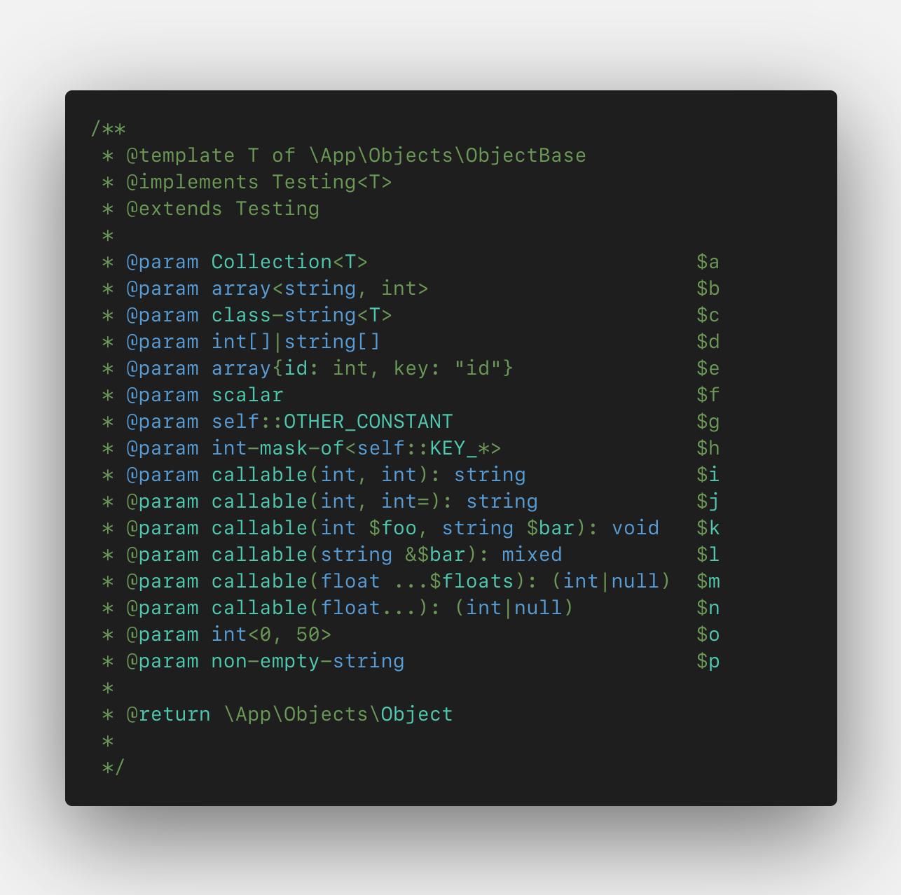
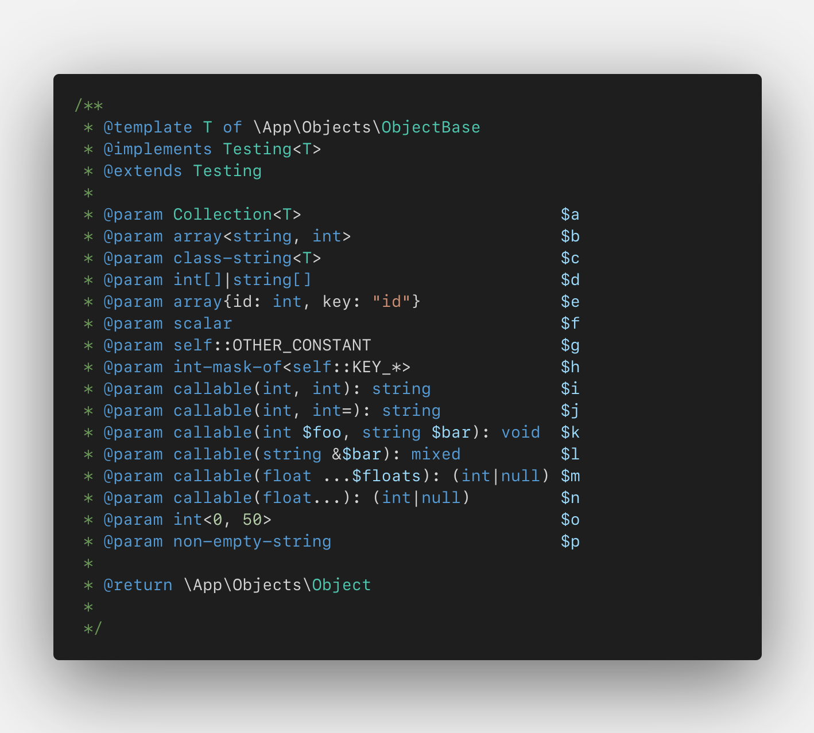

# PHP Extended Types

This extensions supplies additional syntax highlighting for php-doc types.

### Comparison

<table>
  <tr>
    <th>Before</th>
    <th>After</th>
  </tr>
  <tr>
    <td>
      
    </td>
    <td>
      
    </td>
  </tr>
</table>

### Resources
https://phpstan.org/writing-php-code/phpdoc-types
https://github.com/Microsoft/vscode/blob/main/extensions/php/syntaxes/php.tmLanguage.json
