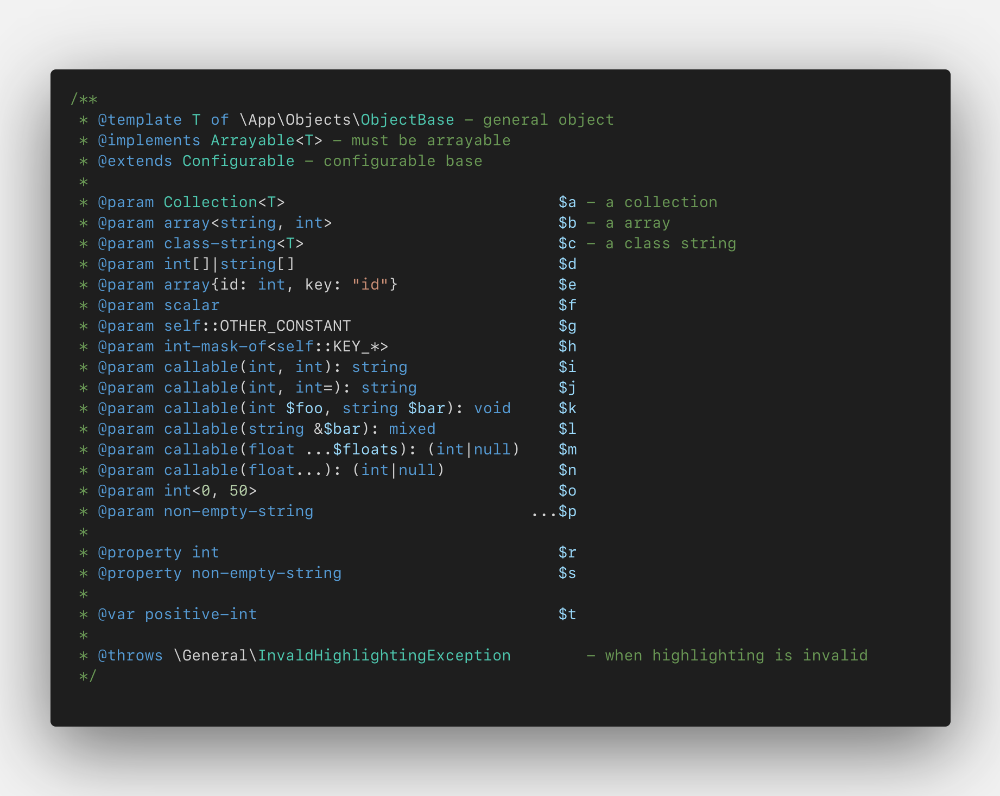

# PHP Doc Extended

This extensions supplies additional syntax highlighting for php-doc types.

### Resources
https://phpstan.org/writing-php-code/phpdoc-types
https://github.com/Microsoft/vscode/blob/main/extensions/php/syntaxes/php.tmLanguage.json
